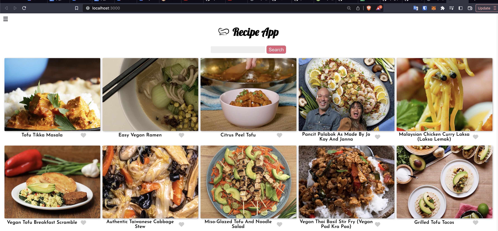
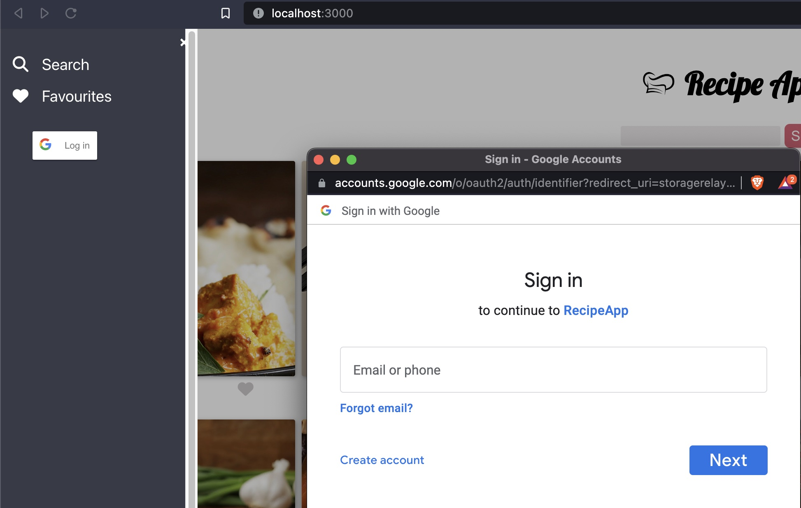
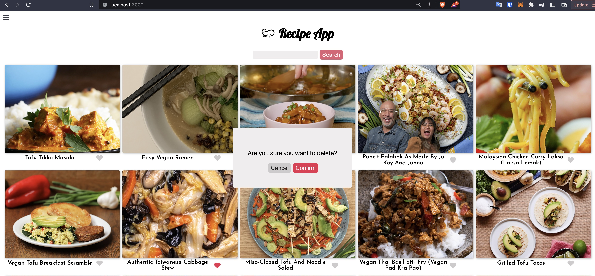

## Tasty React Frontend

### This react project will render recipes from Tasty.com api and allow user to login via Google to add Favorite and notes to a specific recipe.

### This project will consume api from backend using ASP.NET WebApi that will maintain the custom database of User, Note, and Favorite. This React project is being hosted in static Azure Blob.

